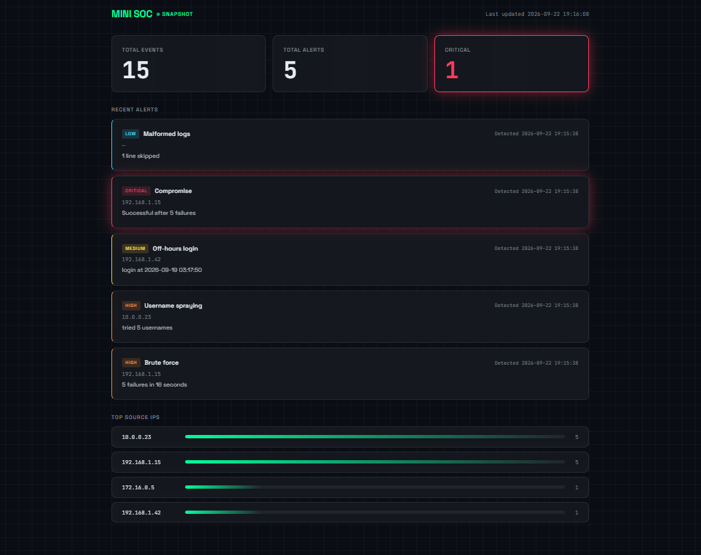

# Mini SOC
A small Security Operations Center tool built in Python. It reads authentication logs, detects suspicious activity with rule-based detections, stores events and alerts in SQLite, and shows them on a local web dashboard.



## Features
- Parses login logs and flags malformed lines
- Five detection rules (see table below)
- SQLite storage with no duplicate events or alerts on re-runs
- Read-only Flask dashboard: summary counts, recent alerts colour-coded by severity, top source IPs by failed logins

## Detection rules
| Rule | Severity | Triggers when |
|---|---|---|
| Compromise | CRITICAL | A successful login follows 3+ failed logins from the same IP within 2 minutes |
| Brute force | HIGH | 5 failed logins from one IP within 2 minutes |
| Username spraying | HIGH | One IP tries 3+ different usernames |
| Off-hours login | MEDIUM | A successful login before 05:00 |
| Malformed logs | LOW | A log line can't be parsed |

## How it works
```
logs/sample.log  →  soc.py  →  soc.db  →  app.py  →  browser
                   (detect)   (SQLite)   (Flask, read-only)
```
- `soc.py` ingests logs, runs detections and writes to the database.
- `app.py` only reads the database and renders the dashboard. It never imports `soc.py`.

## Run it
```bash
git clone https://github.com/diveshh05/Mini-SOC.git
cd Mini-SOC
python -m venv venv
venv\Scripts\activate          # Linux/Mac: source venv/bin/activate
pip install -r requirements.txt

python soc.py                  # ingest logs and detect
flask --app app run            # open http://127.0.0.1:5000
```

Log format, one event per line:

```
2026-09-19 10:32:21 FAILED_LOGIN admin 192.168.1.15
```

## Design decisions

- **No duplicate alerts:** Alerts are unique by rule and source IP. When the same alert fires again with new details (for example "tried 4 usernames" becoming "tried 5"), the existing row is updated with an upsert instead of a duplicate being created.
- **One database connection per request:** Each Flask request runs in its own thread, so the database connection should be opened inside the request, used, and then closed to avoid SQLite thread errors.
- **Dumb template:** The bar percentage is calculated in Python so the HTML template only displays the result and does not contain the calculation/business logic; SQL is used to get the data, while Python prepares it for the template.

## Security

- **Stored XSS test:** I added log entries with `<script>alert(1)</script>` in the source IP field, ran `soc.py`, and loaded the dashboard. The payload was shown as plain text in Top Source IPs and no popup appeared, because Jinja autoescapes every `{{ }}` value (turning `<` into `&lt;`). I never use the `|safe` filter on log data.

## Future improvements

- Store the attack time on each alert (currently only the detection time is stored)
- Skip blank log lines instead of counting them as malformed
- Auto-refresh and a login page for the dashboard

## Built with

Python, SQLite, Flask, Jinja, HTML/CSS